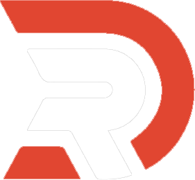

  
   
  <a href="https://www.instagram.com/remi.dbgg/"><kbd>🟣 instagram</kbd></a> <a href="https://lechatlyon.github.io/website/"><kbd>🟢 website</kbd></a>

  

# Porfolio

## ⚡ Overview

- **__Name__ :** Porfolio LeChatLyon
- **Author__ :** LeChatLyon & Rémi.D
- **Purpose :** To showcase my work and experience.
- **Details :** **LeChatLyon - Portfolio** is a web landing page that makes it easy to share my work. Check it out on

<a href="https://lechatlyon.github.io/website/"><kbd>lechatlyon.github.io/website/</kbd></a>.

## 🔥Features

- Portfolio with categories
- Neat interface
- Custom scrollbar
- From bottom to top
- Contact footer
- Dark Theme and Light Theme

## 🤝 Author

    

